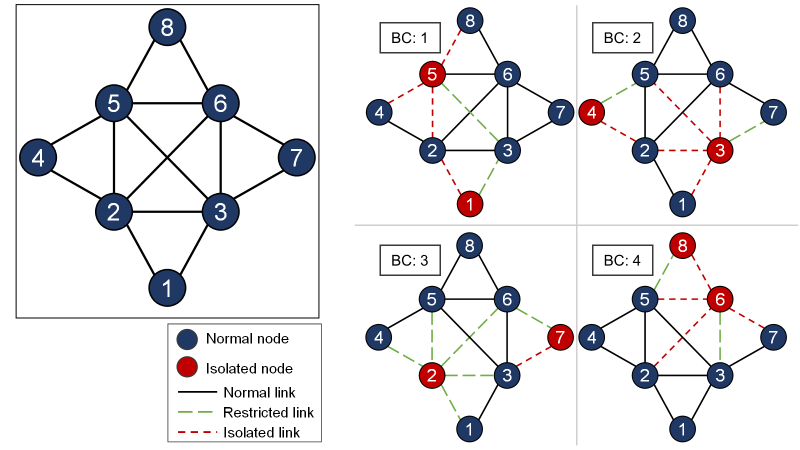

This project is the code of the paper "*P4-based design of fast failure recovery for software-defined networks.*"

## [Multiple Routing Configurations (MRC)](https://doi.org/10.1109/TNET.2008.926507)
In MRC, multiple virtual networks named backup routing configurations for transmitting data after a single link/node failure occurrence are constructed on the basis of a normal routing configuration on a physical network.

## Used backup routing configurations


`h1` is connected to node 4 (`s4`) and `h2` is connected to switch 7 (`s7`).

## Usage

1. The directory with this README also contains an `mrc.p4`.
Compile `mrc.p4` and start the pod-top in Mininet and configure all switches with the appropriate P4 program + table entries:
```bash
make run
```

2. You should now see a Mininet command prompt. Open two terminals for `h1`and `h2`, respectively:
```bash
mininet> xterm h1 h2
```

3. Each host includes a small Python-based messaging client and server. In any host's xterm, send detection packets:
```bash
> python send.py
```

4. In `h2`'s xterm, start the server: 
```bash
> python receive.py 2
```

5. In `h1`'s xterm, send a packet to `h2`:
```bash
> ping 10.0.2.2
```
The packets are received at `h2`, and print configuration number.
```bash
###[ IPv4 hdr Info ]###
ToS   = 0
###[ IPv4 hdr Info ]###
ToS   = 0
###[ ....
```
Here, the ToS field is used for confirmation.

6. At the Mininet command prompt, send the link down command:
```bash
mininet> link s2 s3 down
```

7. `h2` receive the packets:
```bash
###[ IPv4 hdr Info ]###
ToS   = 0
###[ IPv4 hdr Info ]###
ToS   = 0
###[ IPv4 hdr Info ]###
ToS   = 0
###[ IPv4 hdr Info ]###
ToS   = 2
###[ IPv4 hdr Info ]###
ToS   = 2
```

8. Type `exit` or `Ctrl-D` to leave each xterm and the Mininet command line.

> Python Scapy does not natively support the `bp` and `fd` header types so we have
> provided a file called `mrc_hdrs.py` which adds support to Scapy for
> our new custom header.
> 

